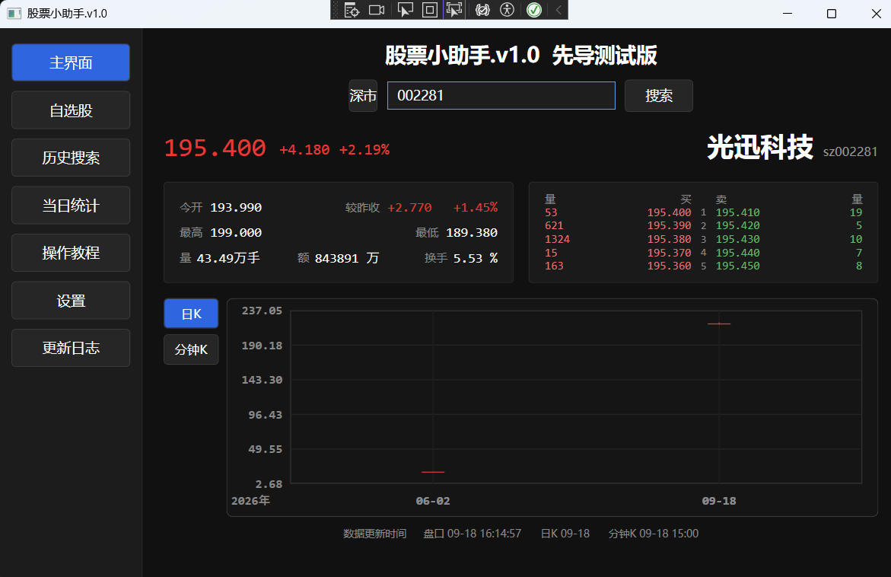

# 股票小助手

一个使用 **C# + WPF** 开发的桌面行情工具，用于查看 A 股 / ETF / 美股（含美股指数）的实时行情、五档盘口、历史日 K 和当日分钟级 K 线。

这是一个个人自学与实践项目，目前主要用于实际查看 ETF 与 A 股行情。

> 当前版本：**v1.0 正式版**

v1.0 是第一个正式版：行情数据获取、解析、运行时数据管理、周期更新这一整条核心数据链路已经跑通，
搜索、实时盘口、历史 K 线等基本功能都已经具备。每个版本具体改了什么，看程序里的"更新日志"页。

## 项目截图



## 当前功能

| 功能    | 说明                                    |
| ----- | ------------------------------------- |
| 市场选择  | 支持选择沪市、深市、美股、美股2（指数），并根据市场自动生成对应接口代码   |
| 快速搜索  | 输入股票代码（A股如 `159248`、美股如 `NVDA`），按回车或点"搜索"即可；程序自动添加接口所需的市场前缀 |
| 搜索冷却  | 两次搜索之间限制 5 秒，按钮显示剩余倒计时，避免重复点击         |
| 实时盘口  | 显示现价、涨跌额、涨跌幅、今开、开盘较昨收、最高、最低、成交量、成交额、换手率 |
| 五档盘口  | 一个表里对照显示：买量 · 买价 · 档位 · 卖价 · 卖量（A股有数据；美股接口不提供五档） |
| 历史日 K | 获取历史每日行情（前复权），绘制成日 K 线图                |
| 当日分钟 K | 获取当日分钟级数据，绘制成分钟 K 线图                    |
| 标的跟随  | 搜索哪个标的，盘口、日 K、分钟 K 就都换成哪个                 |
| 实时区   | K 图下方一行显示三个"数据时间"：盘口 / 日K / 分钟K           |
| 数量格式  | 数量超过 1 万自动换成"万"作单位、保留两位小数（如 `12.17万手`）    |
| 周期更新  | 实时盘口按数据时间戳心跳更新；分钟 K 跨分钟自动更新；日 K 在搜索时更新  |
| K 线交互  | 自绘蜡烛图，悬停看单根数据（开 / 收 / 高 / 低 / 时间）、Ctrl + 滚轮缩放、方向键平移 |
| 更新日志  | 页内记录每个版本的变化，点版本号展开 / 收起                  |

## 设计思路

### 1. 启动自检流程

这是本项目第一次比较完整地实践"程序启动前置条件检查"的思路。

程序启动后并不会立即进入正式界面，而是先经过一套简单的启动流程：

```text
程序启动
    ↓
Loading
    ↓
检查 UserCache
    ↓
读取缓存
    ↓
检查是否成功
    ↓
成功 → 创建正式 UI
失败 → 停止后续流程并报告错误
```

这样做的目的不是让启动流程变得复杂，而是把"程序运行所需要的前置条件"集中处理。

后续随着缓存、自选股等功能增加，可以继续在这套启动逻辑中扩展新的检查项目。

### 2. 心跳更新机制

行情不是"定时无条件拉一次"，而是先检查数据时间戳，变了才去拉数据。

```text
每 0.5 秒检查一次腾讯接口的实时盘口数据更新时间
        ↓
数据时间发生变化
        ↓
获取最新实时行情与五档盘口
        ↓
刷新界面

数据时间没有变化
        ↓
跳过本次更新
```

这样做的目的是把"检查"和"拉取"分开：检查的请求很轻，真正拉数据只发生在数据确实更新之后，
既能及时反映最新行情，又避免了无意义的重复请求。

心跳里其实有**两层判断**，用的是同一个数据时间戳（下面附两种不同的精度）：

```text
数据时间戳（接口原文）
 ├─ 秒级 → 和上一次比：变了就拉实时盘口
 └─ 分钟级 → 和"上次拉到分钟 K 的时刻"比：跨分钟了才拉分钟 K
```

也就是说盘口是"有新数据就更新"，分钟 K 是"跟着盘口更新一起判断、跨分钟才更新"，
两边共用一次请求，不会为了分钟 K 再多发一次轻请求。

日 K 不在这套心跳里 —— 它由搜索触发（见下一节）。

### 3. 根据数据频率采用不同更新策略

项目把数据按更新频率区分处理，而不是所有数据都用同一种刷新机制。

- **实时盘口**：需要尽可能及时，因此由心跳高频检查数据时间戳，变了才拉。
- **当日分钟 K**：一分钟一根，跟着心跳走 —— 盘口确认更新时顺手比一次分钟级时间戳，跨分钟了才拉。
- **历史日 K**：只在搜索时拉取一次，不参与心跳。
- **搜索**：用户点"搜索"（或按回车）时无视上面这些前提，把盘口、日 K、分钟 K 全部拉一遍（带 5 秒冷却）。

整体数据流可以概括为：

```text
用户搜索（或按回车）
 ├─→ 腾讯实时行情与五档盘口
 ├─→ 腾讯历史日 K（前复权）
 └─→ 腾讯当日分钟 K

程序运行期间
 ├─→ 腾讯实时行情：心跳检查数据时间戳，变化才更新
 └─→ 腾讯当日分钟 K：跨分钟时跟着更新

日 K：只在搜索时更新
```

### 4. 获取、处理与展示分开

代码按照功能划分为不同区域和方法，使单个方法尽量只负责一类工作。

例如腾讯行情的基本流程：

```text
PanGet()
 ├─→ 获取数据
 └─→ 刷新界面
```

实际 HTTP 请求、数据解析和 UI 刷新由不同的方法承担。

这种组织方式主要服务于代码的可读性、调试和后续扩展。

## 技术栈

- C#
- .NET 10
- WPF
- HttpClient
- System.Text.Json
- SDK-style .csproj

## 数据来源

本项目使用第三方公开行情接口获取数据，不提供数据服务本身。

| 数据          | 数据来源             | 用途              |
| ----------- | ---------------- | --------------- |
| 实时行情 / 五档盘口 | 腾讯财经行情接口         | 实时价格与盘口         |
| 历史日 K       | 腾讯行情接口（前复权）      | 历史每日行情          |
| 当日分钟 K      | 腾讯行情接口           | 当日分钟级价格         |
| 数据更新时间      | 腾讯接口返回的时间字段      | 判断数据是否更新、显示数据时间 |

同一份接口里，不同市场的单位并不一样：A 股成交量是"手"、成交额是"万元"；美股成交量是"股"、成交额是"美元"。
程序按市场前缀换算后再显示（美股成交额换算成"亿"）。

## 市场代码转换

| 市场 | 接口前缀 | 示例                    |
| -- | ---- | --------------------- |
| 沪市 | sh   | 输入 `600519` → `sh600519` |
| 深市 | sz   | 输入 `159248` → `sz159248` |
| 美股 | us   | 输入 `NVDA` → `usNVDA`（个股 / ETF） |
| 美股2（指数） | us.  | 输入 `DJI` → `us.DJI`；另有 `IXIC` 纳斯达克、`INX` 标普500、`NDX` 纳斯达克100 |

注：腾讯还有 `bj`（北交所）和 `hk`（港股）两个前缀，实测可用，但本程序还没做进市场列表。

## 项目结构

```text
炒股小助手/
├── 炒股小助手.slnx
└── 炒股小助手/
    ├── App.xaml / App.xaml.cs
    │   └── 程序入口（启动总流程 MainFlow：开窗口 → 缓存检查 → 亮主界面 → 启动心跳）与全局界面样式
    │
    ├── MainWindow.xaml / MainWindow.xaml.cs
    │   └── 主窗口外壳、启动动作、页面导航
    │
    ├── MainPage.xaml / MainPage.xaml.cs
    │   └── 市场选择、搜索、盘口图、K 图、实时区、数据拉取（文件内按 A~H 分区）
    │
    ├── Candle.cs
    │   └── K 线数据模型（时间 + 开 / 高 / 低 / 收）
    │
    ├── Quote.cs
    │   └── 盘口数据模型（一次盘口拉取的全部数据：价格、成交、买卖五档、数据时间）
    │
    ├── CandleChart.xaml / CandleChart.xaml.cs
    │   └── 自绘 K 线图控件：悬停气泡（开 / 收 / 高 / 低 / 时间）、Ctrl + 滚轮缩放、方向键平移
    │
    ├── WatchlistPage.xaml / WatchlistPage.xaml.cs
    │   └── 自选股页面（开发中）
    │
    ├── SearchHistoryPage.xaml / SearchHistoryPage.xaml.cs
    │   └── 历史搜索页面（开发中）
    │
    ├── DailyStatsPage.xaml / DailyStatsPage.xaml.cs
    │   └── 当日统计页面（开发中）
    │
    ├── GuidePage.xaml / GuidePage.xaml.cs
    │   └── 操作教程页面（开发中）
    │
    ├── SettingsPage.xaml / SettingsPage.xaml.cs
    │   └── 设置页面（开发中）
    │
    ├── UpdateLogPage.xaml / UpdateLogPage.xaml.cs
    │   └── 更新日志页面（可展开 / 收起，已收录 v1.0）
    │
    └── 炒股小助手.csproj
```

## 当前版本

**v1.0 正式版**（第一个正式版）

当前版本已经跑通核心行情数据链路，也具备了日常看盘需要的基本功能：

```text
市场选择
    ↓
输入代码（或直接按回车）
    ↓
搜索
    ↓
生成腾讯接口代码（市场前缀 + 代码）
    ↓
一次拉三份数据：实时盘口 / 历史日 K / 当日分钟 K
    ↓
解析数据
    ↓
保存到运行时数据（quote 对象 / DailyCandles / MinuteCandles）
    ↓
显示数据（盘口图 / K 图 / 实时区）
    ↓
周期检查（0.5 秒心跳，只比时间戳）
    ↓
发现新数据（盘口：有新数据就更新；分钟 K：跨分钟才更新）
    ↓
更新数据并刷新界面
```

日 K 不参与周期更新，只在每次搜索时重新拉一次。

## 开发思路

这个项目并不是一次性完成所有功能，而是按照以下方式逐步开发：

```text
明确需求
  ↓
设计整体流程
  ↓
确定数据来源
  ↓
设计数据流
  ↓
实现核心功能
  ↓
测试实际数据
  ↓
发现问题并调整
  ↓
逐步扩展功能
```

目前重点放在数据获取与程序运行逻辑上；图表是自绘的蜡烛图，做了缩放 / 平移 / 悬停气泡这些基本交互，
均线、成交量副图之类的指标还没做。

## 项目后续计划

- 完善自选股功能与 UserCache.json 持久化
- 完善历史搜索功能
- 根据历史数据计算 MA5、MA20 等指标
- 完善当日统计功能
- 完善设置页面
- 优化多股票同时更新
- 根据实际使用情况进一步优化数据缓存与更新策略
- 把已经实测可用的北交所（`bj`）与港股（`hk`）加进市场列表
- K 图在多标的、长跨度下的显示优化（前复权后老价格与新价格跨度很大，见"已知限制"）

## 已知限制

- 美股只提供现价、涨跌幅等基础行情，**接口不返回五档买卖盘**（五档表会显示 `--`）
- A 股与美股的成交量 / 成交额单位不同（手 / 万元 与 股 / 美元），程序按市场换算显示
- 行情接口偶尔可能出现连接失败或限频情况，目前失败时跳过本次更新；
  心跳是 0.5 秒一轮，长时间挂着（尤其非交易时段）请求量不小，后续可以按交易时段降频
- UserCache.json 目前只有基础文件结构，自选股持久化尚未完成
- 历史搜索、自选股、当日统计、操作教程、设置五个页面仍是占位页（更新日志页已收录 v1.0）
- 日 K 不自动更新（只在搜索时拉取一次）；分钟 K 只在新的一分钟开始时更新一次
- K 图 Y 轴按"框内数据"自适应：前复权日 K 拉到很早的数据时，老价格与新价格跨度很大，
  缩到全年看时近期蜡烛会被压得很扁，需要放大看细节
- 当前版本主要针对单个标的进行查看，没有做多标的并行刷新

## 运行方式

### 环境要求

- .NET 10 SDK
- Visual Studio 2022 或更高版本（支持当前项目所使用的 .NET / WPF 环境）

### Visual Studio

使用 Visual Studio 打开：

```text
炒股小助手.slnx
```

然后直接运行项目。

### 命令行

```bash
dotnet run --project 炒股小助手/炒股小助手.csproj
```

### 使用方法

1. 启动程序，等待启动检查完成。
2. 点击"市场"按钮选择沪市 / 深市 / 美股 / 美股2（指数）。
3. 输入代码：A 股如 `159248`、美股如 `NVDA`、美股指数如 `DJI`。
4. 点击"搜索"，或者直接在输入框里按回车。
5. 查看盘口图（左边是指标面板，右边是五档盘口表）、K 图（日 K / 分钟 K 可切换）和下方的实时区。
6. 运行过程中：盘口会自动检查更新，分钟 K 跨分钟自动更新，日 K 在每次搜索时更新。
7. 想看版本变化，点左侧"更新日志"。

## 免责声明

本项目仅用于编程学习和个人行情查看。

行情数据来自第三方公开接口，不保证数据的准确性、完整性或实时性。接口格式和访问策略也可能随时发生变化。

本项目不构成任何投资建议，投资决策请以官方及正规行情数据为准。

